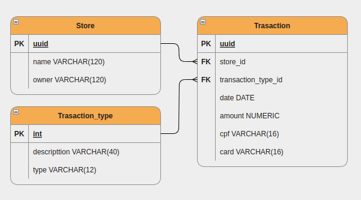

 
# :page_with_curl: Backend Challenge

Desafio Backend, um web app que permite o upload de um arquivo CNAB com os dados das movimentações financeiras de várias lojas. Estes dados são armazenados em um banco de dados relacional, e disponibilizados para consulta.

💭 Features principais:
\
\
:heavy_check_mark: Busca de transações;\
:heavy_check_mark: Checa se o arquivo selecionado para upload é do formato txt.

## 📋 Instruções

Como instalar esse projeto:

- Faça um clone deste repositório;
- Na pasta raiz do projeto, rode o comando `python -m venv venv` (linux) no terminal para criar um ambiente virtual;
- Na pasta raiz do projeto, rode o comando `source venv/bin/activate` (linux) para acessar o ambiente virtual;
- Na pasta raiz do projeto, rode o comando `pip install -r requirements.txt` para installar as dependências;
- Na pasta raiz do projeto, rode o comando `python manage.py migrate`;
- Crie um arquivo `.env` na raiz do projeto e siga o exemplo do `.env.example` que também pode ser encontrado na raiz do projeto;
- Finalmente rode o comando `python manage.py runserver`
- No seu navegador, abra o link indicado no terminal.

## 💻 Tecnologias

Algumas das principais tecnologias utilizadas:

      
  

## :scroll: Diagram

## 🔗 Uteis

> [API](https://frontend-challenge-7bu3nxh76a-uc.a.run.app)
